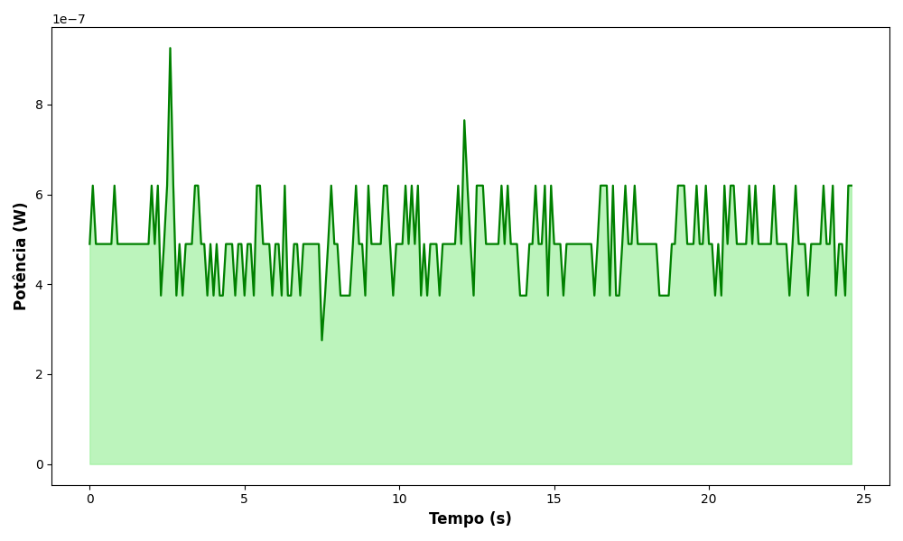

# Medidor de Tensão Elétrica com Arduino Nano

Este projeto foi desenvolvido para o evento de divulgação científica **Grande Desafio**, destinado a jovens do ensino básico. Ele consiste em um **medidor de tensão elétrica** baseado em Arduino Nano, que permite a visualização e análise dos dados de potência em tempo real.

## Objetivo

Construir um sistema de medição de tensão e potência elétrica simples, acessível e didático, utilizando:
- Arduino Nano
- Divisores de tensão
- Comunicação serial com computador
- Armazenamento opcional em cartão SD

O sistema também permite a **visualização gráfica da potência gerada ao longo do tempo** e o **cálculo da energia acumulada**.

## Componentes Utilizados

- Arduino Nano
- Resistores para divisor de tensão (3 MΩ e 100 kΩ)
- Cartão microSD (opcional, para registro dos dados)
- Módulo leitor de cartão SD (opcional)
- Cabos de conexão
- Fonte de tensão a ser medida

## Estrutura do Projeto

O projeto é composto por três arquivos principais:

### 1. `basic_voltmeter.ino`
Código Arduino que realiza a medição da tensão elétrica através de um divisor de tensão e envia as leituras via porta serial para o computador.

Funções principais:
- Leitura da tensão analógica no pino A0.
- Conversão da leitura para valor real considerando o divisor de tensão.
- Cálculo da potência instantânea assumindo resistência de carga conhecida.
- Envio do valor de potência via comunicação serial.

### 2. `sd_voltimeter.ino`
Versão alternativa do projeto que, além de enviar os dados via serial, **armazena as medições em um cartão SD** conectado ao Arduino.

Funções principais:
- Tudo que a versão básica (`basic_voltmeter.ino`) faz.
- Criação e escrita em um arquivo `.csv` no cartão SD com valores de tempo e potência.

### 3. `serial_graph.py`
Script Python utilizado no computador para:
- Ler dados de potência enviados pela serial.
- Exibir **em tempo real** o gráfico de Potência versus Tempo.
- Calcular a **energia acumulada** através da integração numérica pelo método dos trapézios.

> **Nota:** O script assume a porta serial `/dev/ttyUSB0` e taxa de transmissão de 9600 bps. Ajuste conforme necessário.

## Instalação e Uso

1. **Programar o Arduino:**
   - Carregue o `basic_voltmeter.ino` ou `sd_voltimeter.ino` no Arduino Nano usando a IDE Arduino.

2. **Instalar dependências Python:**
   ```bash
   pip install pyserial matplotlib
   ```

3. **Conectar o Arduino ao computador via USB.**

4. **Executar o script Python:**
  ```bash
  python3 serial_graph.py
  ```

5. **(Opcional):** se estiver usando a versão com cartão SD, retire o cartão após o experimento e acesse o arquivo .csv gerado.

## Funcionamento Geral
- A tensão é reduzida por um divisor de tensão para manter-se dentro da faixa segura (0–5V) do Arduino.
- O Arduino lê essa tensão, calcula a potência instantânea e envia os dados via serial.
- O computador lê e plota os valores em tempo real, calculando também a energia acumulada.
- Na versão SD, as medições são salvas automaticamente em um cartão microSD.

## Exemplo de Gráfico Gerado

